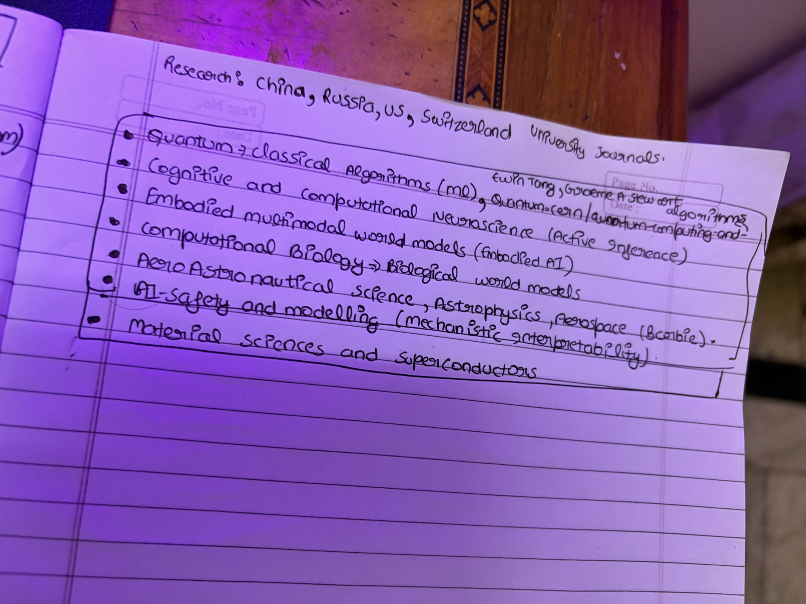
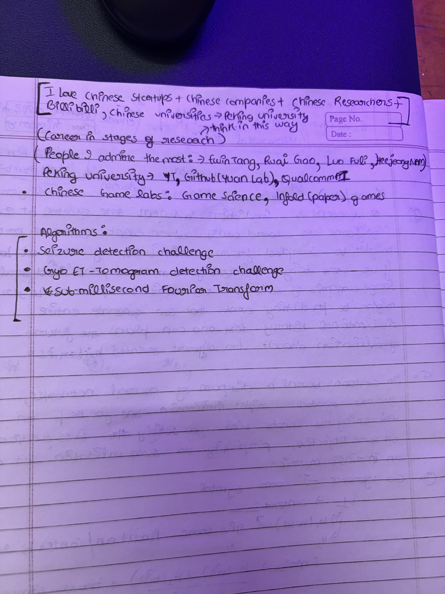

# Research Interests

## Table of Contents

- [Research Directions](#research-directions)
- [Computational Interests](#computational-interests)
- [Areas Actively Being Explored](#areas-actively-being-explored)
- [Computational Biology and Neuroscience](#computational-biology-and-neuroscience)
- [Fields of Interest](#fields-of-interest)
- [Languages to Master](#languages-to-master)
- [Source Scans](#source-scans)

---

## Research Directions

Consolidated domain research and aspirations (from notes and scanned pages).
Current language focus: Julia, Rust.

### Learning Paradigms

- Representation learning
- Causality
- Self-supervised learning
- Continual learning
- Hierarchical reinforcement learning

### Probabilistic and Bayesian

- Active inference (+ complexity systems + probabilistic machine learning)
- Probabilistic programming
- Bayesian statistics
- Hierarchical Pitman-Yor processes

### Complexity and Dynamical Systems

- Complexity science
- Agent-based modelling
- Non-linear dynamical systems / dynamical systems
- Computational behaviour modelling
- Control systems
- Algorithmic game theory

### Interpretability and Safety

- Interpretability toolkits / research-guided principles to discover what lies underneath the models
- Mechanistic interpretability
- AI-safety and modelling

### World Models and Inference

- Video-based world modelling
- Gaussian splats
- Embodied multimodal world models (Embodied AI)
- Biological world models (from computational biology)
- Inference optimization

### Algorithms and Foundations

- Quantum + classical algorithms (Quantum-CERN / quantum computing)
- Symbolic computing
- Optimization algorithms
- Applied category theory
- Knowledge graphs
- Formal concept analysis
- Strongly connected components
- Dynamic programming
- Reverse engineering

### Domains

- Embodied AI | Edge AI | Quantum AI | Computational Neuroscience | Computational Biology
- Cognitive and computational neuroscience (Active Inference)
- Aero / Astronautical science, Astrophysics, Aerospace
- Material sciences and superconductors

### Research Geography

Follow university journals from: China, Russia, US, Switzerland.

---

## Computational Interests

- Multi-threading + parallel computing (GPU parallelism) + distributed computing + high performance computing
- Machine learning (see the machine learning section of the social hub)
- Blockchain (web3 stuff, ask Claude)
- Data visualisation (dev-tools, ask Claude)
- Cloud-native development (Golang, GitHub, ask GitHub)
- Continuous Integration + Continuous Development
- Cache Replacement Algorithms (Huawei 2022, database problem algorithm)
- Medical Imaging -> Digital Twins, SuperVoxels [MedVoxelHD]
- Coding Data -> DataCurve
- LLMs -> Mixture of Experts, communicative interactive agents, structured generation, reasoning, synthetic data generation, benchmarking, mechanistic interpretability

NOTE: check Apple iCloud Notes titled "COMPUTATIONAL INTERESTS" for more information.

Progression ladder: Chatbots -> Reasoning -> Agents -> Organisations -> AGI.

---

## Areas Actively Being Explored

Areas of AI, ML, and computational sciences currently being explored heavily.

### Medical Imaging / GPU Acceleration

Medical image segmentation using deep learning (GANs), e.g. IODeep + MedPipe3D.jl + MedResearch (papers from arXiv / ScienceDirect / Nature journal).

- Image segmentation algorithms / automated lesion segmentation
- Image denoising in k-space
- ML algorithms for Cryogenic Electron Tomography
- Cryo-EM/Tomography, 3D image reconstruction (Chan Zuckerberg Institute imaging areas, HHMI Janelia campus imaging areas)
- Image segmentation algorithms (nnU-Net, MONAI, SciML, Flux), grandchallenges.org
- Physics-informed neural networks, graph convolutional neural networks, temporal graph neural networks
- Modelling and simulation for drug discovery
- Mechanistic interpretability and AI alignment
- Probabilistic programming (Markov models and chains)

### LLMs and Multimodal

Reinforcement Learning with Human Feedback, evaluation of LLMs, hallucinations in LLMs, Retrieval Augmented Generation (RAG), multimodal LLMs (ScaleAI research topics, NolanoAI focus areas, Robust Reading Competition), e.g. DOCVQA, MEDVQA, hierarchical multimodal transformers, on-prem foundational models (AGI Discord server).

### Other Areas

- Vector search datasets and databases, e.g. ChromaDB, Pinecone, Elasticsearch
- Understanding and implementing Graph Convolutional Neural Networks, and graph databases (GraphQL, GraphCNN in Julia, SciML)
- Federated Machine Learning, e.g. PySyft
- GPU programming / GPU acceleration using CUDA
- Distributed systems software engineering (Northwood Space careers listing)
- Coding Data (DataCurve)
- Communicative AI agents, reasoning, structured generation, synthetic data generation, benchmarking -> CamelAI

---

## Computational Biology and Neuroscience

Action Potential Advising. Reference search: [cells in silico repos](https://github.com/search?q=cells%20in%20silico&type=repositories).

### Packages and Datasets

- NeuroAnalyzer.jl
- NeuroTreeModels.jl
- NeuralDataScience
- EEG Notebooks
- Mother of ALL BCI Benchmarks (Moabb)
- Neurodata Without Borders

### Links

- [INCF NWB course](https://training.incf.org/course/introduction-neurodata-without-borders-nwb-python-users-i)
- [BioJulia tutorials](https://biojulia.dev/BioTutorials/de)
- [Epilepsy benchmarks](https://epilepsybenchmarks.com/v/)
- [EPFL ESL student projects](https://www.epfl.ch/labs/esl/studentprojects/)
- [szcore repo](https://github.com/esl-epfl/szcore/tree/main) - **GRIND THIS REPOSITORY**
- [esl-epfl repositories](https://github.com/orgs/esl-epfl/repositories) - **GRIND ON A STUFF AS WELL**
- SciML
- LazyDynamics probabilistic modelling
- [CPU/GPU/ASIC/FPGA intro](https://community.fs.com/article/a-brief-introduction-to-cpu-gpu-asic-and-fpga.html)
- CZI VCell platforms models
- GPUs for: [Lightning pricing](https://lightning.ai/pricing), vast.ai
- [Optica article](https://opg.optica.org/oe/fulltext.cfm?uri=oe-31-22-36468&id=540832)
- [Eleanna Kara Lab](https://www.eleannakaralab.com/research5)
- Neurotorium
- NIH projects
- HTGAA track
- Project from A Star SIPGA related
- Arkansas Summer research program
- ML4Sci similar project

### Focus Areas

Cellular and molecular imaging + EEG + neuromodulation + electrophysiology.

Computational biology track: Firefox + EEG notebooks + Moabb (Mother of All Brain Benchmarks) + HTGAA (virtual cell modelling) + Chanda-Mandisa project database + social_presence.

### Interests

- Neurobiology | Neural computational biology
- Transmission electron microscopy
- Virtual cell modelling, synthetic biology, cells in silico (Cell-Bauhaus, CZI, Frames Catherine White)
- Epigenetics
- Seizure detection algorithms
- Treatment-related disorders
- Bayesian Brain Model, Cognitive Bayesianism, Predictive Coding, Predictive Processing, Free Energy Principle, Active Inference (LazyDynamics, ReactiveBayes, BiasLab, UiT Norway)

---

## Fields of Interest

- Cognitive and computational neuroscience
- Biology (The Selfish Gene, Richard Dawkins)
- Astrophysics (orbital dynamics)
- Aerospace engineering (spacecraft dynamics)
- Olfactory (Aerospace)

---

## Languages to Master

Mojo, Python, Julia, C++, Rust. Current focus: Julia, Rust.

---

## Source Scans

Original handwritten research notes, kept as visual backup.

