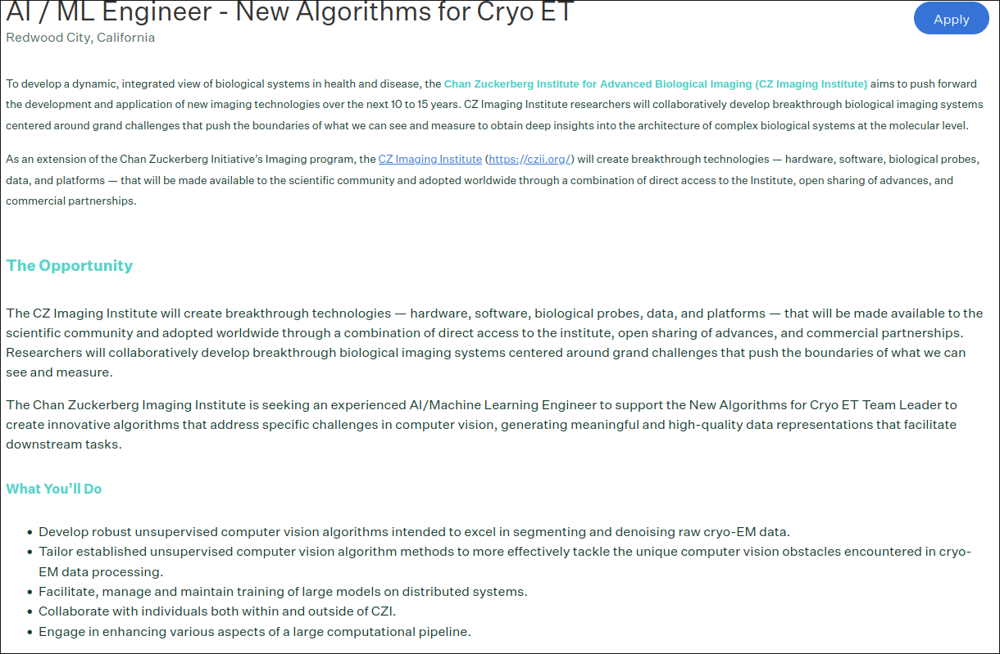
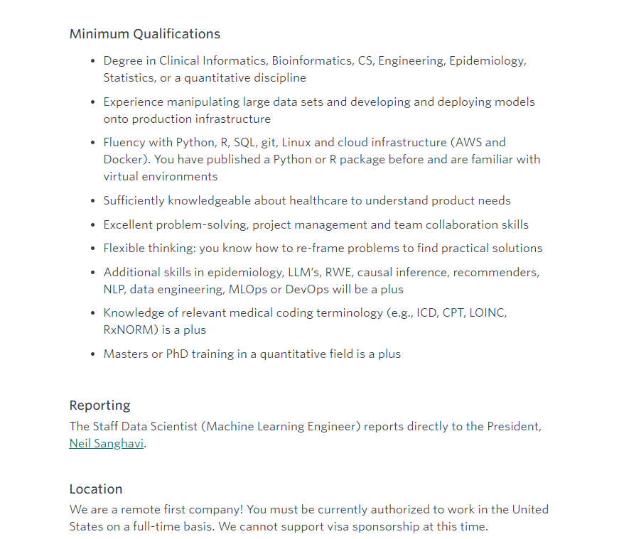
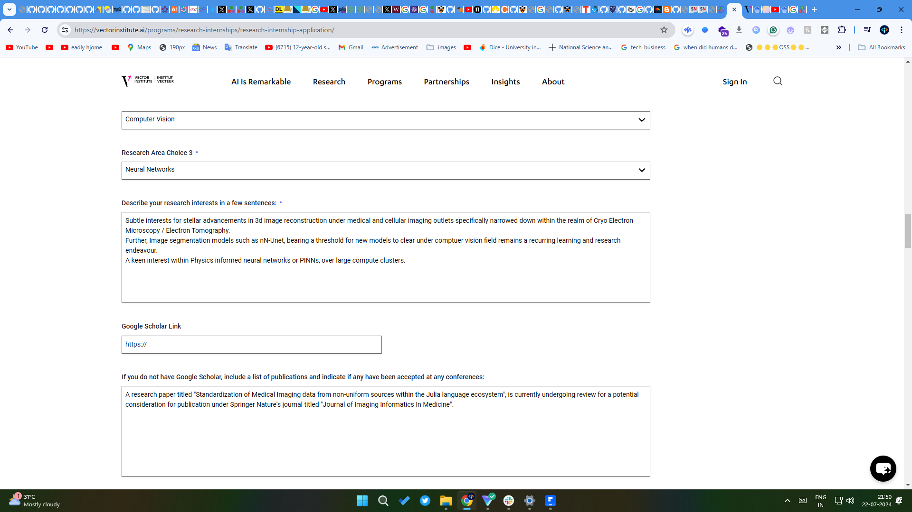
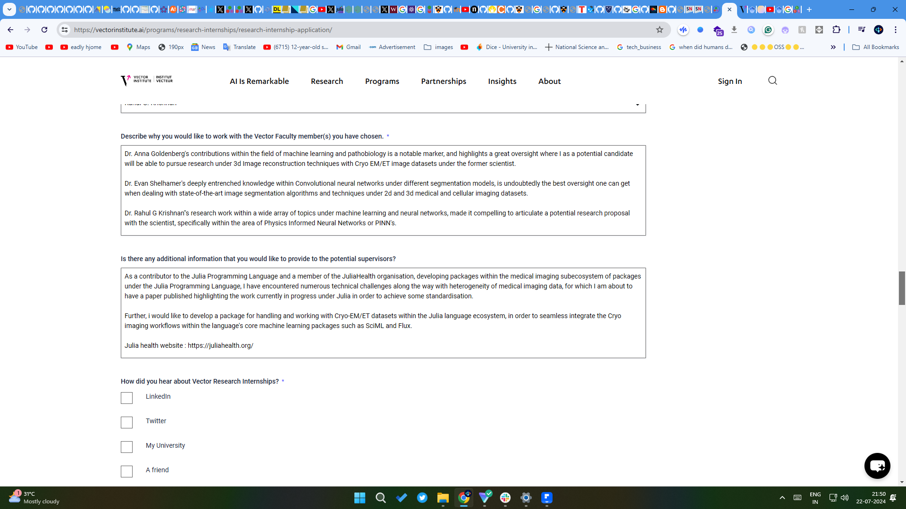

!----GIANT CYBERNETIC COLLECTIVES-----!

x (formerly twitter) @hurtbadly2
threads @Dixi G 
youtube @divital & @hurtbadly
instagram @divital_g & @hurtbadly2004
snapchat (signed email) "divital2004@gmail.com"
facebook @hurtbadly
tiktok @hurtbadly0
linkedin (signed email) "divital2004@gmail.com"

!-------Messaging-----!
Signal (signed phone number) "+919315431855"
whatsapp (signed phone number) "+919315431855"

!--------Social Interesting thingy--------!
BeReal @Hurtbadly
Purp @hurtbadly 
Clubhouse 
Meetup
luma (lu.ma) delightful events start here 
calendly (great scheduling software) 
Alternativeto.net (finding alternatives)

!-------------------Community ----------------------!
CamelAI community [EIGENT-AI slack] 
LabLab-AI community
Cohere for Ai discord
AI alignment commnity [slack]

Mila Udem discord
https://app.gitter.im/#/room/#JuliaDiffEq_Lobby:gitter.im
https://forum.image.sc/
Julia Lang slack  https://discourse.julialang.org/c/domain/probprog/48
OpendMined slack
Flower Slack
OpenSourceScience slack
Genie.jl Discord Server
Mlh Fellowship
Plotly forum  https://community.plotly.com/latest
Microsoft Learn student ambassador

!--------------JOb Search ---------------!
https://society-rse.org/careers/vacancies/ [IMPORTANT]
https://chtc.cs.wisc.edu/fellowships/ [IMPORTANT]
https://www.gw.iucaa.in/ligo-surf-program/ [IMPORTANT , check in november 2025]
https://www.jpl.nasa.gov/edu/internships/apply/ 
ai-jobs.net
SIMPLIFY Extension (JOb search portal)
Levels.fyi (Companies listings)
h1bdata.info 
Greenhouse (whenever u apply for a job, greenhosue provides a template for that job description and stuff)
Indeed 
GlassDoor
Dice.com
GrowJO
ProductHunt
GetLatka databases
Y combinator hacker news
CNCF Job board

!------------------------------NewsLetters----------------!
Substack
Beehiv
Notion hq + notion sites 
Ghost.org
Sanity.io

!-------CREATIVE OUTLETS --------!
Pexels (signed email) "divital2004@gmail.com"
Shutterstock (signed email) "divital2004@gmail.com"
Vsco (singup soon)
Pinterest @Hurtreallybadly (hurtreallybadly@gmail.com)
DeviantART 
BEhance
Dribble
ArtStation 
CgSociety 
CgArchitect 
Figma Community
NOtion COmmunity 
miro (brainstorming , mindmapping and tech diagrams) + figjam (for brain storming and ideation)

!--------------------------3D ANIMATION AND MODELLING (FREELANCING INCLUDED)---------------!
TurboSquid
CGTrader
CgSociety
CgArchitect
Artstation
Cinema4D 
Free3D
sketchfab
V-Ray
Metahuman (Unreal engine)

!------------------Career--------------
roadmaps.sh (for tech roadmaps for learning technologies and stufF)
Producthunt @hurtbadly
Github @divital-coder
Gitlab (another version control system server)
Anaconda notebooks + jupyter notebooks + gooogle collab 
Replit (signed email) & CodePen "divital2004@gmail.com"
HuggingFace @hurtbadly "divital2004@gmail.com"
Kaggle
THefullstackNetwork
Dev COmmunity 
showwcase
CSS Tricks 
Stack Overflow and Stack Exchange 
Polywork
Linux FOundation PRofile (LFM) & Cloud Native COMputing Foundation
leetcode + neetcode 
Devpost 
codewars
cssbattle
ValveSoftware (Computer Vision Engineer)
https://www.getcruise.com/careers/jobs/ (Staff Ml engineer)
https://jobs.siemens-healthineers.com/careers

!---------OpenSource Stuff---------------!
Meta Open Source (LlAmA)
SourceForge (for open source softawre discovery and contributions)

!------------------Artificial Intelligence and Machine Learning Stuff--------------!
Hugging Face (learn category) + gradio + streamlit (workflow)
Cohere LLM (University)
LangChanAi
observable + noteable
theaisummer.com
Safe Super Intelligence Inc https://ssi.inc
Parsl (Parallel scripting in python)
Alan Turing Institute
climatechange.ai
DeepSenseAI
ResearchGate + ARxiv-submissions + Research Square https://www.researchsquare.com/  + googleScholar + OA.mg (https://oa.mg/journals/open-access-quantum-mechanics-journals)
UCI ML (Machine Learning repository for data sets and training)
NeurIPS + ICLR + CVPR + AAAI (from scaleAI internship listings, posts in these platforms)
stableDiffusion (the site for generating images)
"tip  try replicating services offered by scaleAI, to potentially increase ur chances in tech industry"
weights and  biases (platform for building machine learning stuff)
OpenML
datasets from :
data.gov
https://chronicwounddatabase.eu/
data.world
https://radweb.su.domains/datasets/ 
https://aimi.stanford.edu/shared-datasets
awesome-public-datasets from github repo 
Neuraldatascience.io (https://neuraldatascience.io/1-intro/learning_approach.html) & https://github.com/berenslab/neural_data_science
GPT4-o within a web based interface like the old windows 95 winGPT(https://wingpt.vercel.app/)
Mistral AI (open mistral AI models , mixtral model)
Nolano AI
Roboflow
AI Alliance (https://thealliance.ai/aia-members)
NousResearch releases (https://nousresearch.com/releases/)
paperswithcode.com
https://goombalab.github.io/blog/ (Ai channels from julia slack)
https://machinelearningmastery.com/start-here/
https://roadmap.sh/ai-data-scientist

----------------------JULIA DEVELOPMENT------------------------------------------
https://julialang.org/jsoc/allprojects/ [IMPORTANT]
https://info.juliahub.com/products/featured/
https://juliagpu.org/
https://discourse.julialang.org/t/solving-sparse-linear-systems-fast/83071
https://docs.sciml.ai/NonlinearSolve/stable/tutorials/large_systems/
https://discourse.julialang.org/t/examodels-jl-and-madnlp-jl-on-gpus/111377
https://discourse.julialang.org/t/batched-lu-solves-or-factorizations-with-sparse-matrices/106019
https://github.com/exanauts/CUDSS.jl
https://exanauts.github.io/
https://stdntpartners-my.sharepoint.com/personal/divyansh_goyal_studentambassadors_com/_layouts/15/Doc.aspx?sourcedoc={8e27c69a-651e-4cc8-985d-85529c0d8fc7}&action=edit&wd=target%28Projects.one%7Cfbd0e990-3d55-4cc8-a46a-d0bafdfea341%2FJakub%20mitura%20recommendation%20for%20northeastern%20students%20for%20research%7C42410a30-da30-4595-8e19-cdd8492d0998%2F%29&wdorigin=NavigationUrl
https://stdntpartners-my.sharepoint.com/personal/divyansh_goyal_studentambassadors_com/_layouts/15/Doc.aspx?sourcedoc={8e27c69a-651e-4cc8-985d-85529c0d8fc7}&action=edit&wd=target%28Projects.one%7Cfbd0e990-3d55-4cc8-a46a-d0bafdfea341%2FIrnv%20recommendations%7C46a12d5e-888e-491c-8402-dee36a3ae7f9%2F%29&wdorigin=NavigationUrl
------------------------------------------------------------------------------------

https://www.matsprogram.org/ [IMPORTANT] https://docs.google.com/document/d/1p-ggQV3vVWIQuCccXEl1fD0thJOgXimlbBpGk6FI32I/edit?usp=sharing
https://talenthub.vectorinstitute.ai/ [IMPORTANT]
https://www.amii.ca/your-career/career-opportunities/

(learn about all things algos data structs and ai knowledge)
aman.ai (for learning about the grounding knowledge in ai) + https://youtu.be/t2CEgPsws3U?list=RDCMUC8butISFwT-Wl7EV0hUK0BQ
http://www.mmds.org/
https://vast.ai/careers
https://www.together.ai/about#careers
https://nebius.com/
https://lambdalabs.com/careers#join
-----------------------AI Resarch Labs---------------------------
Vector Institute for AI
Mila/Udem Institute for AI (Professor Irina Rish)
Santa Fe institute undergrad complexity research
The Alan Turing Institute
Openminded Federated machine learning 
MBZUAI - Mohd AI
Singapore international pregrad award SIPGA A* Research Intern
Cohere for AI
Cohere Research Scholar [Important]

AI Conferences:
NeurIPS , ICLR , ICML, Association for Computational Linguistics, ICVPR, "ECML PKDD" (for visual question answering research papers), ICDAR

AI Hackathons : 
https://lablab.ai/event (lablab.ai)
https://devpost.com/hackathons (devpost ai hackathons)
Colosseum.org (blockchain hackathons, ai hackathons)
https://sites.nyuad.nyu.edu/hackathon/ (quantum computing hackathon)
https://qworld.net (quantum computing hackathons)

(MEDICAL IMAGING INSTITUTES)
https://ezlab.princeton.edu/contact/  [IMPORTANT, Apply for the Masters program to join https://lsi.princeton.edu/education/quantitative-computational-biology-graduate-program]
chan zuckerberg imaging institute https://www.czimaginginstitute.org/careers/ https://github.com/czimaginginstitute  https://chanzuckerberg.com/careers/career-opportunities/?lists=all&lists=artificial-intelligence
center of advanced imaging institute https://cai2r.net/research/  https://cai2r.net/resources/#data
wellcome center human neuroimageing https://www.fil.ion.ucl.ac.uk/about/vacancies-and-careers/
[architecture firm]  https://www.atrr.ca/company
siemens healthineers https://jobs.siemens-healthineers.com/careers?query=intern&location=any&pid=563156119397676&level=student%20%28not%20yet%20wgraduated%29&level=recent%20college%20graduate&domain=siemens.com&sort_by=relevance&hl=en
GE healthcare [https://careers.gehealthcare.com/global/en/internships]
Medical Imaging (https://www.medicalimaging.org/medical-imaging)
Medical Imaging Challenges , Grand Challenges (https://grand-challenge.org/challenges/)
Image Sciences Institute (https://www.isi.uu.nl/vacancies/)
UMC Utrecht (https://www.werkenbijumcutrecht.nl/vacatures?o=0&n=10&of=8180726&f=5397647&hl=0&hh=48#vacancy-overview)
ImagO (https://www.imago.uu.nl/)
ASCI Distributed computing institute (https://asci.school/)
Image Sciences tutorial (https://imagescience.org/tutorials/)
Howard Hughes Medical Institute, Janelia campus
Magnetic Resonance Book (https://www.magnetic-resonance.org/ch/06-01.html)
Leukemia Database for Image Processing (https://scotti.di.unimi.it/all/)
Cancer Imaging Archive (https://wiki.cancerimagingarchive.net/display/Public/Challenge+competitions)
Rochester Institute of Technology, phd in Imaging Science (https://www.rit.edu/science/chester-f-carlson-center-imaging-science#research)
Search for Imaging Science Competitions on brave, chrome, firefox and other search engines. use google dorking with gpt-4o. (WinGPT)
---https://www.nanoartography.org/2023
---https://www.rms.org.uk/outreach.html
---https://www.snf.ch/en/xcDCNJikRZXwYWC5/page/science-communication/image-competition
Sample Imaging CT data from cancer imaging archive (https://www.cancerimagingarchive.net/collection/ct-org/)
Danaher Sciences careers (https://jobs.danaher.com/global/en?utm_source=dhls_website&utm_medium=referral&utm_content=footer)
MonAI (framework) (https://monai.io/started.html) (https://monai.io/model-zoo)
Starred package and repositories on github (https://github.com/divital-coder?tab=stars)
OneNote Medical Imaging project note with resources : https://stdntpartners-my.sharepoint.com/personal/divyansh_goyal_studentambassadors_com/_layouts/15/Doc.aspx?sourcedoc={8e27c69a-651e-4cc8-985d-85529c0d8fc7}&action=edit&wd=target%28BackdropBuild.one%7Cfbd0e990-3d55-4cc8-a46a-d0bafdfea341%2FProject%20%20Medical%20Image%20%28brain%5C%29%2C%20visualisation%2C%7C54a88332-5ae4-4741-977b-e744f1a9c8be%2F%29&wdorigin=NavigationUrl
OPI (https://opi.org.pl/en/) National Information Processing Institute
Carmias toolkit (https://carimas.fi/carimasce/)
CANON medical imaging internship [november-january application deadline] (https://research.eu.medical.canon/careers/internship-program/) (https://www.research.us.medical.canon/opportunities/)
[MEDICAL IMAGING DEEP LEARNING CONFERENCE](https://www.midl.io/job-board)
[MICCAI](https://miccai.org/index.php/job-board/?start=9)
https://www.aicjanelia.org/instruments
https://www.janelia.org/open-science/overview/open-science-software-initiative-ossi
https://www.nimbios.org/
https://ai-jobs.net/?key=cryo+EM&exp=&sal=
https://aijobs.app/?c=Internship
https://www.mlmia-unitue.de/
https://www.helmholtz-munich.de/en/iml
https://med.nyu.edu/departments-institutes/radiology/research/ai-biomedical-imaging
University College London Msc. Program https://www.ucl.ac.uk/prospective-students/graduate/taught-degrees/artificial-intelligence-and-medical-imaging-msc
Computation Imaging and AI in Medicine https://compai-lab.github.io/ [IMPORTANT]
University of Cambridge Research Assistantship (Probabilistic Programming) https://www.jobs.cam.ac.uk/job/?category=2  https://mlg.eng.cam.ac.uk/
StudentShips with University of Exeter https://www.exeterbrc.nihr.ac.uk/training/type/phd-studentships/ 

Educational resources and publications : 
https://link.springer.com/search?new-search=true&query=medical+imaging&content-type=review&dateFrom=&dateTo=&sortBy=relevance
https://www.nature.com/collections/ebfjiijhgc?gad_source=1&gclid=CjwKCAjw1K-zBhBIEiwAWeCOFw7oNIkQHAGqq9WlaOmXOMZjXuvbkUXczFJ4DDKienqSkSgkd6ZPPBoCgyQQAvD_BwE
https://link.springer.com/article/10.1007/s10278-024-01083-0
https://link.springer.com/article/10.1007/s12559-024-10291-3
https://hal.science/search/index?q=domain_t%3Asdv+medical+imaging
Pirates bay search for medical imaging stuff (https://tprbay.pw/search/medical%20imaging/1/99/0)
https://openreview.net/forum?id=M6CfJ5H7XH
https://www.reddit.com/r/Julia/comments/17z0gsg/looking_for_up_to_date_advanced_julia_programming/
https://book.sciml.ai/
https://julia.quantecon.org/intro.html
https://julialang.org/learning/tutorials/
https://github.com/brenhinkeller/JuliaAdviceForMatlabProgrammers
https://jmirpublications.com/?__hstc=102212634.0bad7b93397ea5c8e2dc4d8d2d9d9453.1720173762276.1720173762276.1720173762276.1&__hssc=102212634.1.1720173762276&__hsfp=1054730769
https://biodatamining.biomedcentral.com/articles/10.1186/s13040-017-0155-3
https://www.embopress.org/doi/full/10.15252/msb.20156651
http://www.cellimagelibrary.org/pages/datasets
https://chanzuckerberg.github.io/cryoet-data-portal/cryoet_data_portal_docsite_aws.html
https://www.sciencedirect.com/science/article/pii/S1877750322002630
https://www.frontiersin.org/research-topics/49921/breakthroughs-in-cryo-em-with-machine-learning-and-artificial-intelligence/articles
https://www.turing.ac.uk/research/research-projects/deep-learning-cryogenic-electron-microscopy
https://www.nature.com/articles/s41467-024-46041-0
https://medschool.vanderbilt.edu/basic-sciences/2024/06/03/stop-the-gap-new-cryo-et-package-aims-to-fill-in-the-missing-wedge/
https://youtu.be/SQDLlZkoCJU
https://asmp-eurasipjournals.springeropen.com/articles/10.1186/s13636-018-0124-x
https://www.scribd.com/document/535781314/ML
https://web.math.princeton.edu/~amits/research.html
https://www.pacm.princeton.edu/people/amit-singer
https://spr.math.princeton.edu/reading
https://spr.math.princeton.edu/SOFTWARE
https://3demmethods.i2pc.es/index.php/Main_Page [IMPORTANT]
https://www.moleculardevices.com/applications/cell-imaging
https://www.emdataresource.org/emsoftware.html [IMPORTANT]
https://www.vanderbilt.edu/csb/facilities/cryo-electron-microscopy/cryo-em-software/
https://www.shrec.net/cryo-et/
https://www.shrec.net/
https://ossi.janelia.org/
https://ossi.janelia.org/projects/ [Important]
https://mlg.eng.cam.ac.uk/pub/ https://mlg.eng.cam.ac.uk/

https://stdntpartners-my.sharepoint.com/personal/divyansh_goyal_studentambassadors_com/_layouts/15/Doc.aspx?sourcedoc={8e27c69a-651e-4cc8-985d-85529c0d8fc7}&action=edit&wd=target%28Projects.one%7Cfbd0e990-3d55-4cc8-a46a-d0bafdfea341%2FsProject%20%20Medical%20Image%20%28brain%5C%29%2C%20visualisation%2C%7C54a88332-5ae4-4741-977b-e744f1a9c8be%2F%29&wdorigin=NavigationUrl [IMPORTANT]

[Undergraduate Research for summer listings]
https://www.indiascienceandtechnology.gov.in/listingpage/internships
https://www.aamc.org/career-development/affinity-groups/great/summer-undergrad-research-programs
https://college.emory.edu/undergraduate-research/opportunity/opportunity-finder.htmlwhat 
Amgen Scholars [Requires english language proficiency test]
University of Singapore A STAR
Vector Research Internships
SantaFe complexity researcher
[THERMO FISTHER](https://www.thermofisher.com/id/en/home/electron-microscopy/life-sciences/learning-center/resources/cryo-em-careers.html#career-paths)
[EMBL](https://www.embl.org/about/info/undergraduates/)
[EMBL](https://www.embl.org/research/units/)
[INSTRUCT](https://instruct-eric.org/jobs)
[INSTRUCT](https://i2pc.es/instruct-platforms/)

[CHECK THE IMAGES DIRECTORY UNDER SOCIAL_PRESENCE](CHECK THE IMAGES DIRECTORY UNDER SOCIAL_PRESENCE)
https://bssw.io/pages/bssw-fellowship-program  [ONLY for US Affiliated University Students]

[Skills for algorithms for medical imaging by czi]

[Commercial Industry under medical imaging outlets, electronics and software]
[TEMPUS](https://www.tempus.com/job-postings/?department=&location=&filter=&remoteFriendly=0)
[BUTTERFLY NETWORK](https://www.butterflynetwork.com/careers#open-roles)
[ATROPOS HEALTH](https://www.atroposhealth.com/careers)
[STRUCTURA BIO](https://structura.bio/)
[INSTA DEEP](https://www.instadeep.com/job-offer/b25ebfc8-c298-4ce8-a300-6f47d385d812/)

https://www.cs.cornell.edu/courseinfo/listofcscourses [SUPER IMPORTANT FOR LEARNING]
http://www.mmds.org/
-------------------------------------------------------------------

(AI Alignment and Mechanistic Interpretability)
Opportunities : 
https://www.aisafetysupport.org/lots-of-links#h.b0w2c5fsdf2d  [Important]
https://www.lesswrong.com/
https://www.aisafety.com/

Educationa Resources : 
https://course.aisafetyfundamentals.com/Alignment
https://github.com/callummcdougall/ARENA_2.0
https://forum.effectivealtruism.org/posts/7WXPkpqKGKewAymJf/how-to-pursue-a-career-in-technical-ai-alignment
https://80000hours.org/career-guide/personal-fit/ [Supplementary]
https://github.com/dit7ya/awesome-ai-alignment
https://courses.openmined.org/
https://www.neelnanda.io/mechanistic-interpretability

!-----------------------Julia community networking --------------------!
Barcelona julia health meetup group (Genie.jl) https://www.meetup.com/groups/
Julia community otganizations https://julialang.org/community/organizations/
MLJ.jl https://github.com/alan-turing-institute/MLJ.jl/blob/dev/CONTRIBUTING.md https://github.com/alan-turing-institute/MLJ.jl?tab=readme-ov-file https://alan-turing-institute.github.io/MLJ.jl/dev/
Julia con and julia con sponsorsA for opportunitites https://juliacon.org/2024/
julia jobns wiki https://en.wikibooks.org/w/index.php?title=Introducing_Julia/Jobs
julia hub careers https://juliahub.com/
pumasAI careers https://pumasai.com/careers
julia lang forem https://forem.julialang.org/search?q=&filters=class_name:Organization
julia lang discourse jobs tag https://discourse.julialang.org/tag/jobs/l/latest
Numfocus IG life science shared drive https://drive.google.com/drive/folders/0AP53T0JdGQK-Uk9PVA
NumFocus Inc people emails :
alexy@opensource.science (manager)
arliss@numfocus.org (manager)
Eileenkoski@gmail.com (content manager)
jon@numfocus.org (manager)
leah@numfocus.org (manager)
nicole@numfocus.org (manager)
nolan@numfocus.org (manager)
life-sciences@opensource.science (OSSci Life science IG commenter)
rapsomaniki.marianna@gmail.com (content manager)
tim@opensource.science (manager)
Numfocus shared drive resources https://docs.google.com/spreadsheets/d/1XdvuYmrLSVRFmpBaBY9uXsVts8uXjhdL/edit#gid=589676214  https://docs.google.com/spreadsheets/d/1ODKbjEWpB3Sb7-jbqQMW0vQT4TG7ZDVx0tWVExN4AHA/edit#gid=0
Numfocu shared drive recordings https://drive.google.com/drive/folders/1Vv6XF3udRb0yhhbIUQUedDXL9r181-1h
Numfocus GSOc and community projects https://numfocus.org/programs/google-summer-code https://github.com/numfocus/gsoc https://numfocus.medium.com/ https://numfocus.org/community/people
The Genie frameworks and community https://genieframework.com/ , GEnie discord server  https://github.com/GenieFramework/Genie.jl https://www.linkedin.com/in/cpalumbo/ https://genieframework.com/blog
Julia language contributions page https://julialang.org/contribute/#:~:text=Contributing%20to%20the%20Julia%20ecosystem%20brings%20the%20following%20benefits%3A,Build%20confidence%20with%20Julia.
Aurora Rossi julia phd candidate https://aurorarossi.github.io/menu3/
Climate modelling alliance https://clima.caltech.edu/
Axiomatic AI https://www.axiomatic-ai.com/

---------------------------------Cloud Compute-----------------------------
https://github.com/zszazi/Deep-learning-in-cloud
https://www.together.ai/ 
lambda labs
Nebius

Cloud Native Computing Foundation AI projects 

!------------------------BlockChain stuff--------------------------------!
OpenSea
THeAlchemy (WEB 3 institute)
Ethereum , Solana Development communities 
arweave blockchain (community labs + permaweb)
celestia labs  (modular)
chainlink hackathons 
HyperLedger

!------------------------------Quantum Computing-----------------------------!
https://www.nqcc.ac.uk/uk-quantum-hackathon-2024/
https://www.iquise.mit.edu/iQuHACK/2024-02-02
https://www.worldquant.com/iqc/
https://qworld.net/

!----------------Augmented Reality and Virtual Reality stuff----------------!
Meta Spark
Snap AR

!------------------cyber security and infrastructure security---------------------!
hackerone
bugcrowd
synack team
cybrary
Black Hat conference
Defcon
hackersploit
TEam field manual (Red team field manual + blue team field manual)
World Campus Tech Club https://sites.psu.edu/wctechclub/ 
BTDigg (torrent search engine)
https://crackmes.one/
https://pwn.college/
https://pwnable.tw/
https://github.com/zardus/wargame-nexus
https://samsclass.info/127/127_F19.shtml
https://guyinatuxedo.github.io/03-beginner_re/pico18_strings/index.html
https://gitlab.com/exploit-database/
https://blog.ret2.io/2018/09/11/scalable-security-education/
https://attack.mitre.org/tactics/enterprise/
https://github.com/HACKE-RC
https://dev.to/bartosz/top-10-reverse-engineering-tools-3ni3

!---------------------------API development---------------------
FastAPI (python library)
Quandl
rapid API
alphavantage api
yahoo finance api

!---------------Blog like platforms---------------!
Blogger : hurtreallbadly.blogspot.com
Medium + Hashnode 
SubStack (Newsletter)
Moodle (BLog and writing stuff)
Reddit @hurtreallybadly
Discord @hurtbadly & @hurtreallybadly
Slack
Mastodon 
Tumblr 
*Start your own custom blog hosten on ur web based skillset :)

!--------------Live streaming Platforms---------------!
Twitch @hurtbadly 
Kick @hurtbadly (maybe)
younow @divital2004
liveme (mobile only)
bigo live (mobile only)

!-------------Meetings--------------------!
Meetup
Gather.app / Gather.town
Zoom

!-------------------E-Learning---------------------!
CourseEra
Ibm SKill Build 
Udemy 
Edx
O'reilly 
Pluralight
ARM Developer HUb  (Advanced RISC Machines)
Nvidia AI development Tracks / paths

!----------------------------Free computer science Education-----------------------!
FullstackOPen.com (university of helsinki, credits in modern web application development and design)
OpenSourceSocietyUniversity (Learn from a wide variety of courses and submit a project in the end)
Dash Enterprise App Gallery (MAKE UR OWN CUSTOM PROJECTS IN JULIA AND DASH WEB APPLICATION FRAMEWORK TO UNDERSTAND SOFTWARE ENGINERERING FROM A ROBUST PERSPECTIVE)
University of Helsinki (Open University Courses)

!--------------------Softawre Hackathons and stuff----------------------!
DevPost
Kaggle
DrivenData
MachineHack Gen Ai

!-----------Cloud native development and stuff--------!
Cloud Native Computing Foundation (CNCF) Project + Ambassador
Linux Foundation Scholarships
nginx + supabase + firebase 
mongoDB + cloud databases  +kubernetes + docker

!------Music and SOunds---------------------!
Spotify 
SoundCloud 
Youtube Music
Apple music

!--------------------------Subscription Based stuff---------------!
Patreon 
GumRoad
OnlyFans
Fansly 
Passes.com 

!------------------payment systems and commercialisation stuff---------!
Stripe atlas 
Shopify 
Ebay 
Amazon 
Craigslist 
ClickFunnels (Sales funnel from kevin david)

!-----------------------open source mapping and proprietary mapping integrations---------------------------!
Polymap
Leaflet
Mapbox

!------------------------VOlunteer work-------------------------!
InternetArchive  (Wayback machine)
CatchaFire
Github open source contributions
Julia ML models on huggingface

!-------------------Company Discovery------------------!
Growjo
ProductHunt
GetLatka Databases
Y Combinator Hacker news

!------------------------------Storage and organisation-------------!
Playbook (storage, modern)

!-------other Interesting tools for building modern apps---------!
Mapbox 

-----------------------------------DARK WEB LINKS FOR INFORMATION------------------------
gentoomen-library (for condensed computer science knowledge)
z-library (for finding books mentioned within gentoomen-library)
just-another-library (library for finding even more books)
goalkicker.com (for comprehensive cheathsheets on everything)
libgen.rs
sci-hub.se
!-------BONUS, LIST OF THIRD PARTY LINK AGGREGRATORS (linktree, allmylinks)---------------------!

amouranth linktree : linktr.ee/amouranth (amazing person in terms of social growth and living life on a barn)
cherryCrushASRM linktree : linktre../myCherryCrush (an awesome marketer and an amazing content creator), her personal site : myCherryCrush.com
Alice Delish (all her links on her personal site) :  alicedelish.com (the girl who hit 1 million followers on X)

!---------------nostalgic ,miscellaneous things ------------------------!
Google Earth (locate your favourite places and travel all across the world, wherever u want)

!--------------Information saved from the web----------------------------!
Google chrome saved bookmarks
Microsoft Edge saved bookmarks
Winwdows Os screenshots
Brave bookmarks
Realmex, Iphone6 screenshots
Self whatsapp Chat
Self slack chat
Added discord servers 
Saved LinkedinPosts
Saved Instagram posts
Saved X posts
Saved Reddit posts
Saved and Liked youtube videos and playlist (ML ones, Deno.js ones, svelte and Dear Imgui ones)
Macbook screenshots
Apple notes information
Onenote information
Mem labs informaiton
Notion information

